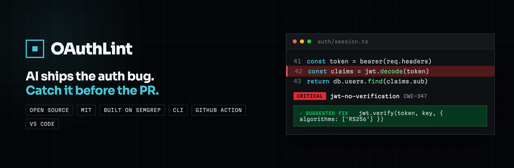

<div align="center">

<a href="https://oauthlint.dev"></a>

**Catch the OAuth / OIDC / JWT / session / CORS anti-patterns AI coding tools systematically produce.**

A curated, multi-language Semgrep rule pack with **dataflow (taint) analysis** (JS/TS · Python · Go · Rust · Java, and growing) · CLI + GitHub Action + VS Code extension · free & MIT licensed

[](https://github.com/Auspeo/oauthlint/actions/workflows/ci.yml)
[](https://www.npmjs.com/package/oauthlint)
[](https://www.npmjs.com/package/oauthlint)
[](LICENSE)
[](https://marketplace.visualstudio.com/items?itemName=auspeo.oauthlint-vscode)
[](https://oauthlint.dev)
[](https://semgrep.dev)

</div>

```bash
npx oauthlint scan ./src
```

> Requires [Semgrep](https://semgrep.dev) on the machine running the scan (`pipx install semgrep` or `brew install semgrep`).

📖 **Full documentation & rule catalogue: [oauthlint.dev](https://oauthlint.dev)** · 🔬 **the empirical case for it: [oauthlint.dev/research](https://oauthlint.dev/research)**

---

## What it is

AI coding assistants (tools like GitHub Copilot, Cursor, and Claude Code, and others) ship the same OAuth/JWT bugs across every project they touch:

- JWT verified with `alg: none` accepted
- `client_secret` hard-coded in source
- `redirect_uri` whitelisted with `*` wildcards
- token written to `localStorage` (XSS-readable)
- OAuth flow without `state` / without PKCE
- `/login` POST without rate limiting
- password persisted in plaintext
- `Math.random()` used for CSRF tokens
- untrusted input flowing into a redirect or an outbound request (**open-redirect / SSRF**), caught by **dataflow (taint) analysis** rather than plain pattern-matching
- …and many more: 140+ rules across JavaScript/TypeScript, Python, Go, Rust, and Java

oauthlint sits between generic SAST (Snyk, Semgrep) and enterprise IAM ($50K+/year): free, focused, and built for the developer who has to fix the finding. Every finding links to a page explaining *why it matters* and *how to fix it*.

## Why OAuthLint and not just Semgrep?

Honest answer: nothing stops you from writing these rules yourself. Semgrep is open source, it's the engine we run, and a capable engineer could reproduce a lot of this. We don't have a technical moat, and we won't pretend otherwise.

What we have is the work most people never do:

- **Low false positives, validated against real auth libraries.** We run the rules against `jose`, NextAuth, PyJWT, Authlib, `golang/oauth2`, `oauth2-rs`, Spring and more. Anything that fires on mature library source goes to a triage queue, not to you. Tuning a rule so it doesn't trip on `jose`'s internals is the tedious, invisible work the generic Semgrep registry skips. (See the [validation report](https://oauthlint.dev/validation): thousands of files of real auth-library source, zero false positives on the clean libraries.)
- **One coherent product across every language it covers.** Same concept, same ID scheme, same docs. `AUTH-JWT-001` in JS maps to `AUTH-GO-JWT-001` in Go, instead of a patchwork of community rules with mismatched styles.
- **Every finding teaches.** Every rule links to a fix page with CWE and OWASP mappings, so a finding is a lesson rather than a grep hit.
- **Dataflow, not only patterns.** Taint-mode rules trace untrusted input through to dangerous sinks (open-redirect, SSRF), catching bugs a single-line pattern would miss.
- **The angle the registry doesn't have.** OAuthLint targets the OAuth/JWT bugs AI coding tools ship on repeat. Each rule encodes that in its `llm-prevalence` metadata, and the empirical [/research](https://oauthlint.dev/research) report measures it.

Use OAuthLint when you'd rather not write and maintain an auth rule pack yourself. That's the whole pitch.

## What it looks like


Every finding names the rule, the exact file and line, why it is dangerous, and
a link to the fix.

## Quick start

### CLI

```bash
# one-shot scan, no install
npx oauthlint scan ./src

# fail CI on HIGH severity and above
npx oauthlint scan ./src --fail-on HIGH

# machine-readable output
npx oauthlint scan ./src --json

# GitHub Code Scanning
npx oauthlint scan ./src --format sarif > oauthlint.sarif

# a shareable, self-contained HTML audit report
npx oauthlint scan ./src --format html > report.html

# auto-apply safe fixes (e.g. cookie flags); preview them first with --fix-dry-run
npx oauthlint scan ./src --fix-dry-run
npx oauthlint scan ./src --fix

# incremental: scan only what changed (fast; great for pre-commit hooks)
npx oauthlint scan --diff       # vs the default branch
npx oauthlint scan --staged     # only git-staged files

# adopt on an existing codebase: snapshot today's findings, then alert on NEW ones only
npx oauthlint baseline ./src
npx oauthlint scan ./src --baseline --fail-on HIGH
```

Other commands: `oauthlint list` (browse rules), `oauthlint explain <rule-id>` (read a rule's why and fix in your terminal), `oauthlint init` (write a config), `oauthlint doctor` (check your setup).

### GitHub Action

```yaml
- uses: Auspeo/oauthlint@v1
  with:
    severity: HIGH
    fail-on: HIGH
```

The Action is **Docker-based**, so it runs in any repository's CI regardless of the project's language. `Auspeo/oauthlint@v1` is the [GitHub Marketplace](https://github.com/marketplace) entrypoint; the original `Auspeo/oauthlint/action@v1` subpath still works and behaves identically. The SARIF output (`--format sarif`) uploads to [GitHub Code Scanning](https://oauthlint.dev/docs/code-scanning), and there's a recipe for [GitLab CI](https://oauthlint.dev/docs/gitlab-ci) too.

### VS Code / Cursor / Windsurf

Install **[oauthlint](https://marketplace.visualstudio.com/items?itemName=auspeo.oauthlint-vscode)** from the VS Code Marketplace (or [OpenVSX](https://open-vsx.org/extension/auspeo/oauthlint-vscode) for Cursor / Windsurf) for inline diagnostics on save, a status-bar finding count, an "Apply fix" Quick Fix where a rule ships a safe autofix, and Quick Fix suppressions.

### MCP server (scan AI-generated code in-loop)

`oauthlint-mcp` is an [MCP](https://modelcontextprotocol.io) server that hands the rule pack to AI coding tools (Claude Code, Cursor, Windsurf, and others) so they can scan the OAuth code they just wrote, in the same loop that produced it. The bug gets caught before it reaches your diff.

```jsonc
// add to your tool's MCP config
{
  "mcpServers": {
    "oauthlint": { "command": "npx", "args": ["oauthlint-mcp"] }
  }
}
```

The `oauthlint-mcp` package ships with the next release; until then it runs from source. Setup for each tool is at [oauthlint.dev/docs/mcp](https://oauthlint.dev/docs/mcp).

### Use directly with Semgrep

Already have [Semgrep](https://semgrep.dev)? Run the **full pack** with one command, no install and no config file:

```bash
semgrep --config https://oauthlint.dev/r/oauthlint.yaml ./src
```

Per-language bundles are available too (e.g. `oauthlint-python.yaml`, `oauthlint-go.yaml`). The hosted config is always the latest pack; for a pinned ruleset, use the `oauthlint` CLI / [`oauthlint-rules`](https://www.npmjs.com/package/oauthlint-rules) on npm. See [the Semgrep docs](https://oauthlint.dev/docs/semgrep).

### Inline suppression

```ts
// oauthlint-disable-next-line auth.jwt.alg-none -- legacy code, replaced in Q2
return jwt.verify(token, key, { algorithms: ['RS256', 'none'] });
```

Wholesale silencing (`oauthlint-disable-file *`) is intentionally unsupported. The next reviewer needs to see exactly which lines opted out.

## Rules

**140+ rules** across OAuth 2.0, OIDC, JWT, cookies, CORS, secrets and session hygiene, in JavaScript/TypeScript, Python, Go, Rust, and Java. Each is mapped to CWE and OWASP and has a documentation page. Some are **taint-mode dataflow rules** that follow untrusted input to its sink rather than matching a single line: an OAuth credential reaching a log sink, request input reaching a JWT verification key, or a value flowing into a redirect or outbound request (open-redirect, SSRF). SSRF coverage now spans JS/TS, Python, Go, Java (Spring) and Rust (reqwest), and a dedicated rule catches `Authorization: Basic` credentials written to logs. The catalogue grows with every release.

👉 **Browse the full catalogue at [oauthlint.dev/rules](https://oauthlint.dev/rules/).**

## Language support

oauthlint is built on [Semgrep](https://semgrep.dev), whose engine is **language-agnostic**. The rules are plain YAML data, so adding a language means **writing rule packs**, not re-architecting anything.

| Language | Status |
|----------|:------:|
| JavaScript / TypeScript | ✅ shipping |
| Python (PyJWT, requests, Flask, Django) | ✅ shipping |
| Go (golang-jwt, crypto/tls, net/http) | ✅ shipping |
| Rust (jsonwebtoken, reqwest, actix/tower) | ✅ shipping |
| Java (Spring Security, jjwt, nimbus-jose-jwt) | ✅ shipping |
| More (open an issue to request your stack) | 🔜 planned |

**Why JS/TS first?** That's where AI coding tools generate the most code, and so the most OAuth/JWT bugs. It's the densest place to start, not the ceiling. Want your stack covered? [Open an issue](https://github.com/Auspeo/oauthlint/issues).

## What's in this repo

| Package | What it does |
|---------|--------------|
| [`rules/`](rules) | Semgrep rules (JS/TS · Python · Go · Rust · Java), schema-validated, with vulnerable + safe fixtures |
| [`cli/`](cli) | `scan` (incremental `--diff` / `--staged`), `baseline`, `list`, `init`, `doctor`, with pretty + JSON + SARIF + HTML output |
| [`action/`](action) | Docker-based GitHub Action wrapping the CLI, with inline PR annotations + job summary |
| [`vscode/`](vscode) | VS Code / Cursor / Windsurf extension (Marketplace + OpenVSX): diagnostics, status bar + Quick Fix suppressions |
| [`mcp/`](mcp) | `oauthlint-mcp`, an MCP server that lets AI coding tools scan the OAuth code they generate, in-loop ([docs](https://oauthlint.dev/docs/mcp)) |
| [`examples/`](examples) | Deliberately-vulnerable demo apps used for dogfooding |

## Develop

```bash
pnpm install
pnpm test:run     # full suite: rule pack + CLI + Action + VS Code + scripts
pnpm lint
pnpm build
pnpm typecheck
pnpm --filter oauthlint-site dev     # preview the docs site locally
```

**Adding a rule:** drop a YAML file in `rules/rules/<category>/`, add `vulnerable.ts` + `safe.ts` fixtures, and the schema-driven tests pick it up automatically. The docs site (`site/`) generates its rule pages straight from the rule pack, so no separate docs-refresh step is needed.

### Commits & releases

- **[Conventional Commits](https://www.conventionalcommits.org)** are enforced (`feat:`, `fix:`, `docs:`, `chore:`, …) via a `commit-msg` hook.
- **Git hooks** (husky): `pre-commit` runs Biome on staged files; `pre-push` runs typecheck + the full test suite.
- **Releases** use [Changesets](https://github.com/changesets/changesets); see [RELEASE.md](RELEASE.md).

## Roadmap

Where OAuthLint stands, and where it is going. Want to help with any of it? See
[Contributing](#contributing) below; false-positive reports and new rules are
especially welcome.

### Shipped

- 155 rules across JavaScript/TypeScript, Python, Go, Java, and Rust
- Autofix with a dry-run preview, plus dataflow (taint) analysis
- SARIF output and GitHub code scanning, a GitHub Action, and GitLab CI
- VS Code extension, also on Open VSX for Cursor, Windsurf, and similar editors
- MCP server, so AI coding tools scan the auth code they generate, in-loop
- Shareable HTML reports
- A guide for writing your own low-false-positive rules ([docs](https://oauthlint.dev/docs/writing-rules))

### Now

- More framework-aware rules: Django REST, Express/Helmet, Laravel, and more,
  tuned for high signal and low false positives
- Closing rule-parity gaps across the five supported languages

### Next

- A reproducible "auth and AI" benchmark: which OAuth/JWT anti-patterns each AI
  coding tool actually produces
- More integrations: JetBrains IDEs, Azure and Bitbucket pipelines
- Wider autofix coverage, so more findings ship a safe one-click rewrite

### Exploring

- Interprocedural dataflow for deeper taint tracking
- A hosted MCP endpoint for cloud-based agents

## Contributing

The most useful contribution is telling us when a rule is wrong: open a
[false-positive issue](https://github.com/Auspeo/oauthlint/issues/new/choose).
Want a new anti-pattern caught, or want to write the rule yourself? See
**[CONTRIBUTING.md](CONTRIBUTING.md)**. A rule is one YAML file plus a
`vulnerable.ts` / `safe.ts` fixture pair. By participating you agree to the
[Code of Conduct](CODE_OF_CONDUCT.md).

## License

MIT. See [LICENSE](LICENSE). Built and maintained by [Auspeo](https://github.com/Auspeo).
